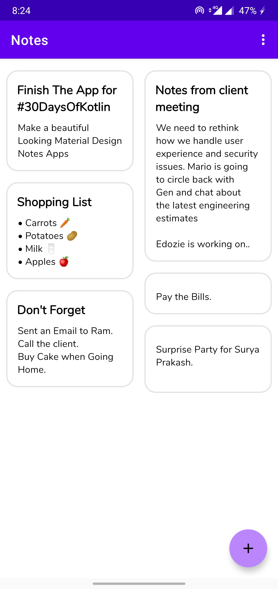
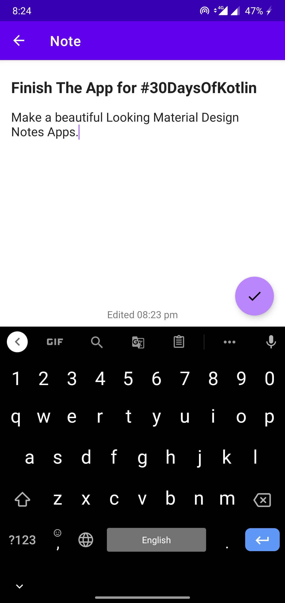
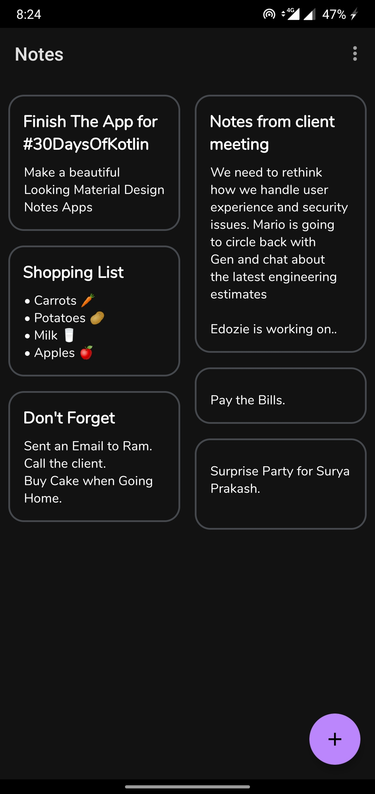

# Notes-App-Kotlin
A Simple Material Design Notes taking application built with Kotlin for #30DaysOfKotlin.

Notes App is a simple app developed to take notes Quickly

## ⬇Download 
Download and try the app. 
Download from Releases page [**here**](https://github.com/saif191020/Notes-App-Kotlin/releases/tag/v1.0) or from Google Drive Link [**here**](https://drive.google.com/file/d/1U0R2fYCpjBvDcFXk5pQ1XDVZef9B7Z7Y/view?usp=sharing)

## 🖼 Screenshots

<table style="width:100%">
  <tr>
    <th>Home</th>
    <th>Add/Edit Notes page</th>
    <th>Dark Theme</th>
  </tr>
  <tr>
    <td></td> 
    <td></td>
    <td>
  </tr>
</table>

### Concepts implemented in the project
1. Room Persistence Library - To store Notes created By the User.
2. Navigation component - To move between different fragments in-app. 
3. Data Binding - To access the views directly and The accessing of view reduced the overhead and the app performance
increased drastically.
4. Recycler View - To Display the notes stored By the user
5. Coroutines - To  perform database related operations asynchronously (Database Operation Include insert/delete/deleteAll/update/retrieve ALl)
6. Material Design Library - Used throughout the app to maintain Consistency with Android Design Guideline 
7. Dark Mode (Night Mode) - Saves Battery and Reduces strain on eyes.

## 🛠 Built With 
- [Kotlin](https://kotlinlang.org/) - First class and official programming language for Android development.
- [Room persistence library](https://developer.android.com/topic/libraries/architecture/room) - The Room persistence library provides an abstraction layer over SQLite to allow for more robust database access while harnessing the full power of SQLite.
- [Data Binding Library](https://developer.android.com/topic/libraries/data-binding) - The Data Binding Library is a support library that allows you to bind UI components in your layouts to data sources in your app using a declarative format rather than programmatically.
- [Material Design](https://material.io/design/) - Material is an adaptable system of guidelines, components, and tools that support the best practices of user interface design.
- [Navigation Components Architecture ](https://developer.android.com/guide/navigation)- Android Jetpack's Navigation component helps you implement navigation, from simple button clicks to more complex patterns
- [slidetoact](https://github.com/cortinico/slidetoact) - A simple 'Slide to Unlock' Material widget for Android, written in Kotlin)- A simple 'Slide to Unlock' Material widget for Android, written in Kotlin [Used in app to avoid Accidental deletion of all Notes]

## 📃 License

This project is licensed under the MIT License - see the [LICENSE](LICENSE) file for details

***
> Feel free to star ⭐ this repository if you like what you see 😉.
